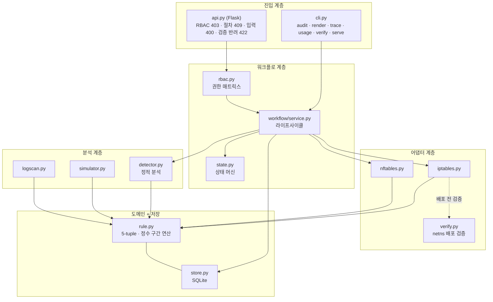
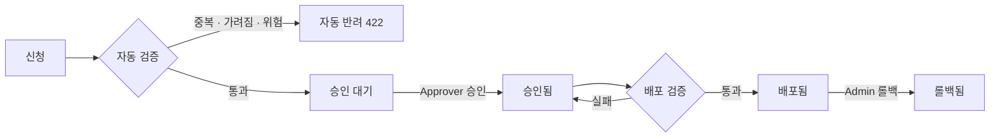

# PolicyGate

[](https://github.com/sokldjs554/PolicyGate/actions/workflows/ci.yml)


**Docs:** [Architecture (ADR)](docs/ARCHITECTURE.md) · [API](docs/API.md) · [Benchmark](docs/BENCHMARK.md) · [Verification](docs/VERIFICATION.md)

PolicyGate는 방화벽 정책의 신청부터 검증, 승인, 배포, 롤백까지 자동화하는
Policy-as-Code 플랫폼입니다. 정책이 배포되기 전에 중복과 충돌, 위험한 설정을
정적 분석으로 걸러내고, 격리된 커널에서 설정이 정상 적용되는지 확인한 뒤에만
배포합니다. 모든 변경은 변경 전후 상태와 함께 감사 로그에 남습니다.

<!--
  [데모 GIF 자리]
  아래 한 줄의 주석을 풀고 docs/demo.gif를 추가하세요.
  추천 장면(15~20초): audit로 문제 8건 탐지 → sudo verify로 커널 검증 통과 → any-any 신청이 422로 자동 반려
  녹화 도구: asciinema + agg, terminalizer, 또는 peek
-->
<!--  -->

## 만들게 된 배경

보안 엔지니어 직무를 준비하면서 방화벽 정책 관리가 생각보다 수작업에
가깝다는 걸 알게 됐습니다. 신청은 티켓으로 받고, 이미 열려 있는 정책인지는
담당자가 일일이 확인하고, 점검용으로 열어둔 임시 정책이 만료된 채 방치되는
일도 흔하다고 합니다. 이 과정을 코드로 옮기면 어디까지 자동화할 수 있을지
궁금해서 시작한 프로젝트입니다.

## 주요 기능

- 정적 분석 — Shadowing(가려져서 절대 매칭되지 않는 정책), Redundancy, 순서
  민감 충돌, 위험 노출(any-any, 인터넷 대상 RDP/SMB 등 13종 포트), 만료 정책 탐지
- 자동 검증 게이트 — 신청 즉시 기존 정책 셋과 대조, 중복·위험은 사유와 함께 반려
- 승인 통제 — RBAC 4역할 + 상태 머신, 신청자 본인 승인 금지
- 배포 검증 — 격리 namespace 커널에 적용 후 readback 대조, 통과해야만 배포
- 롤백과 감사 — 모든 변경에 timestamp / actor / action / before / after 기록
- 동적 분석 — 트래픽 시뮬레이터(`trace`), 로그 대조 미사용 정책 탐지(`usage`)
- 벤더 중립 — 같은 정책 모델에서 iptables / nftables 생성

## 아키텍처





의존은 위에서 아래로만 흐릅니다. 설계 결정 13건은
[docs/ARCHITECTURE.md](docs/ARCHITECTURE.md)에 대안 비교와 함께 기록했습니다.

## 배포 검증

배포 전에 격리된 network namespace의 커널에 설정을 실제 적용하고 readback으로
전 정책을 대조합니다. 통과한 설정만 배포됩니다.

```console
$ sudo python -m policygate.cli verify sample_data/policies.csv
검증 통과: 모든 정책이 커널에 적용됨 (기본 정책 DROP 확인)
커널 적용 확인: 정책 12건 전부 readback 대조 통과
```

동작 원리, 실패 케이스(정책 누락 탐지, 커널 거부), 워크플로 연동은
[docs/VERIFICATION.md](docs/VERIFICATION.md)에 있습니다.

## 성능

Intel Xeon @ 2.80GHz (2 cores) · RAM 8 GB · Ubuntu 24.04 · Python 3.11.15 ·
규모당 3회 반복 후 중앙값

| 정책 수 | 쌍 비교 수 | 전체 분석 | Shadow 탐지 | Redundant 탐지 | 피크 메모리 |
|--------:|-----------:|----------:|------------:|---------------:|------------:|
| 1,000 | 499,500 | 0.06s | 0.04s | 0.04s | 2.2 MB |
| 10,000 | 49,995,000 | 2.72s | 2.71s | 2.78s | 22.0 MB |


전체 결과(100 / 5,000 포함)와 측정 방법, 빠른 이유, 확장 경로는
[docs/BENCHMARK.md](docs/BENCHMARK.md)에 있습니다.

## 시작하기

```bash
pip install -r requirements.txt              # Flask, click
python -m unittest discover -s tests         # 테스트 136개
python -m policygate.cli audit sample_data/policies.csv        # 정책 대장 감사
sudo python -m policygate.cli verify sample_data/policies.csv  # 배포 검증 (Linux)
python -m policygate.cli serve --db policygate.db --port 8080  # API 서버
```

```bash
# 신청 — 즉시 자동 검증, 위반이면 422와 사유 반환
curl -X POST localhost:8080/api/requests -H 'X-User: alice' -H 'Content-Type: application/json' \
  -d '{"src":"10.5.0.0/24","dst":"10.9.0.10/32","protocol":"tcp","dst_ports":"8080","description":"배치 서버 -> 내부 API"}'

# 배포 — verify:true면 커널 검증을 통과해야만 배포
curl -X POST localhost:8080/api/requests/REQ-0001/deploy -H 'X-User: bob' \
  -H 'Content-Type: application/json' -d '{"adapter":"iptables","verify":true}'
```

전체 엔드포인트와 역할별 권한, 오류 코드는 [docs/API.md](docs/API.md)를 보세요.

## Architecture Decision Records

핵심 결정 몇 가지 — 전체 13건은 [docs/ARCHITECTURE.md](docs/ARCHITECTURE.md)에.

- 절차는 상태 머신 화이트리스트로 강제, 승인 없는 배포는 코드상 불가능 (ADR-4)
- Shadowing 판정은 보수적으로 — 거짓 양성 0을 검출률보다 우선 (ADR-2)
- CIDR을 정수 구간으로 환원한 관계 연산, Interval Tree/Trie 확장 경로 (ADR-11)
- 동시 신청 테스트로 ID 채번 race를 발견해 원자 카운터로 교체 (ADR-12)

## Current Limitations

- IPv4 전용. IPv6, 존(zone), 출발지 포트는 입력 단계에서 명시적으로 거부
- 여러 정책의 합집합이 만드는 가림(union shadowing)은 CORRELATED 경고로만 표시
- 미사용 정책 판정은 로그 관측 기간에 한정 (삭제가 아닌 회수 검토만 권고)
- 배포 검증의 커널은 호스트 커널 — 상용 방화벽 장비에서는 검증하지 않음
- 인증은 X-User 헤더 방식의 데모 수준 (SSO 교체 전제로 경계를 함수 하나에 격리)
- SQLite 기반 단일 노드

## Roadmap

- 만료 정책 자동 회수와 소유자 알림
- Interval Tree / Patricia Trie 인덱싱 (수만 건 이상 규모)
- 다수 장비 배포: 어댑터 SSH/API 확장 + 장비별 readback 검증
- SSO(OIDC) 연동과 승인 2인 원칙

## 요구 사항

Python 3.10+ / 의존성: Flask, click (분석 엔진은 표준 라이브러리만) /
배포 검증: Linux + root(CAP_NET_ADMIN) + unshare + iptables
