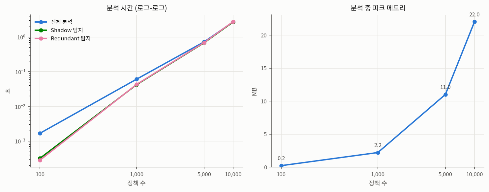

# 성능 벤치마크

`python -m benchmarks.bench` 측정 결과입니다. Shadow/Redundant 탐지는 동일한 쌍 스캔을 공유하므로 시간이 거의 같습니다 — 운영에서는 `analyze()` 한 번으로 둘 다 얻습니다.

## 측정 환경

- CPU: Intel(R) Xeon(R) Processor @ 2.80GHz (2 cores)
- RAM: 8 GB
- OS: Linux 6.18.5
- Python: 3.11.15
- 측정 방식: 규모당 3회 반복, **중앙값** 보고 (메모리는 tracemalloc 오버헤드 격리를 위해 별도 1회 실행)

## 결과

| 정책 수 | 쌍 비교 수 | 전체 분석 | Shadow 탐지 | Redundant 탐지 | 피크 메모리 |
|--------:|-----------:|----------:|------------:|---------------:|------------:|
| 100 | 4,950 | 0.00s | 0.00s | 0.00s | 0.2 MB |
| 1,000 | 499,500 | 0.06s | 0.04s | 0.04s | 2.2 MB |
| 5,000 | 12,497,500 | 0.72s | 0.68s | 0.69s | 11.0 MB |
| 10,000 | 49,995,000 | 2.72s | 2.71s | 2.78s | 22.0 MB |

## 해석

쌍 비교 수는 n(n-1)/2로 늘어나므로 분석 시간도 이차 함수로 성장합니다. 그래프의 로그-로그 스케일에서 기울기 2의 직선이 이를 보여줍니다.

정책 10,000건(쌍 비교 약 5천만 회)이 3초 안에 끝나는 이유는 두 가지입니다. 첫째, CIDR을 정수 구간 (시작주소, 끝주소)로 변환해 포함/교차 판정을 정수 대소 비교로 환원했습니다. CIDR은 정의상 연속된 주소 구간이므로 이 변환에 의미 손실이 없습니다. 둘째, 안쪽 루프에 빠른 탈락 경로를 두어 src 또는 dst가 아예 겹치지 않는 쌍(현실 정책 셋의 대부분)을 정수 비교 4회로 즉시 제외합니다.

이보다 큰 규모가 필요해지면 Interval Tree로 후보 쌍 조회를 O(n log n + K)로 줄이는 경로가 있습니다. 적용 지점과 트레이드오프는 ARCHITECTURE.md의 ADR-11에 정리했습니다.

벤치마크 데이터셋은 대부분 겹치지 않는 정책에 약 5%의 중복/포함 정책을 심어 생성합니다. 빠른 탈락 경로와 정밀 판정 경로를 모두 통과시키기 위한 구성입니다. 재현: `python -m benchmarks.bench --repeat 3 --plot`
